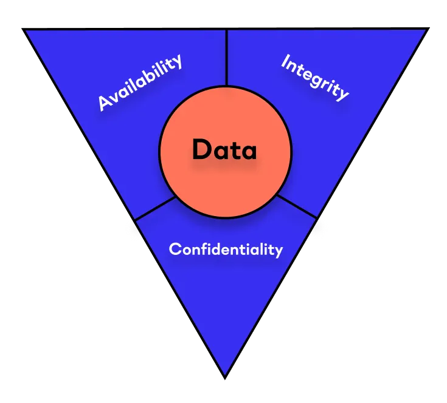
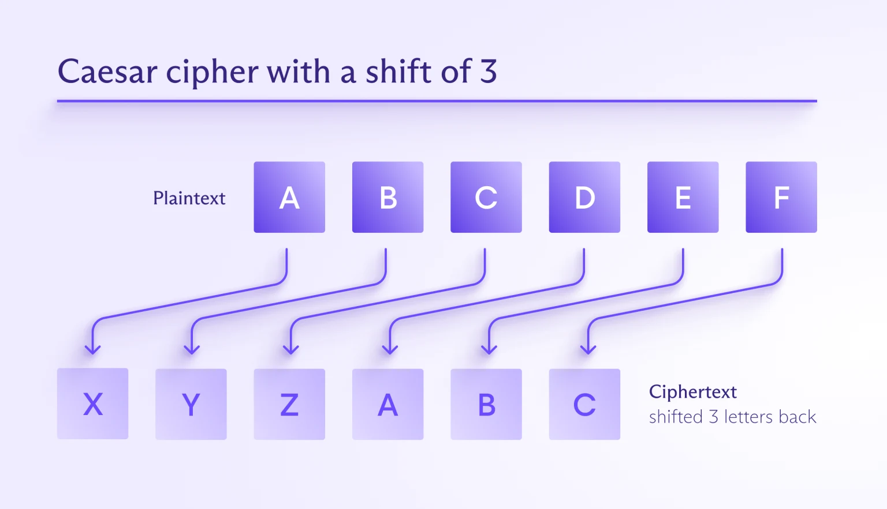
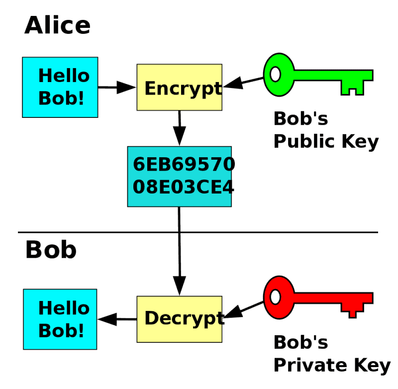
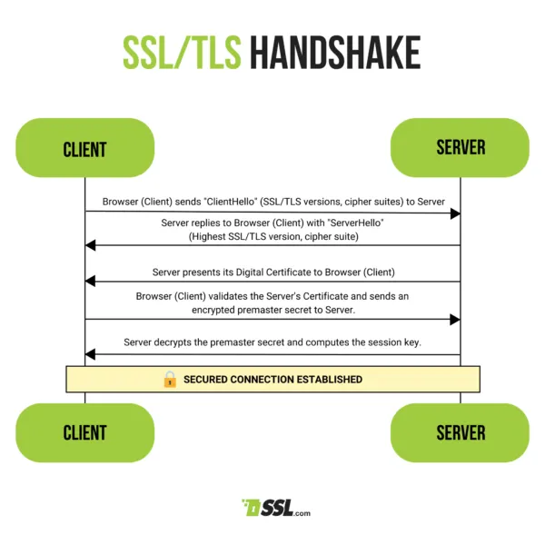

---
## Lidt blandet basal sikkerhed

---
## Hard- og softwaresikkerhed

* Noget sikkerhed er på hardware lag, noget på software
	* Hardware: TCG-OPAL direkte på SSD-diske, TPM på motherboard
	* Software: Kryptering af data, autenticering osv. Fokus i dag!
---

## CIA triad - Fundamentet for moderne sikkerhed

---

## Datasikkerhed - CIA

* Confidentiality - Hvis andre ser dataen, kan de så læse det? Hvem kan se dataen? 
* Integrity - Er dataen korrekt? Sikret mod korruption? Er det 100% som fra kilden?
* Availability - Er dataen tilgængelig til dem der skal have adgang til det? På alle de tidspunkter som de skal have adgang til det?

---

## Måder at sikre data på

* Kryptering - Få data til at være ulæseligt for uvedkommende selv hvis de får fat i det, men kan oversættes af en selv.
* Hashing - Lav en unik "hash-værdi" af input. Kan ikke oversættes tilbage til original, heller ikke af ejer. Typisk kun til autenticering; passwords gemmes som hashede værdier
* Fysisk sikkerhed - Gøre dataen komplet utilgængelig rent fysisk for uvedkommende. Lidt svært med data på internettet, men brugbart for lagret data komplementært til kryptering og automatisk sletning af online data

---

## MQTT og CIA triad
* Lille øvelse: Prøv at relatere kryptering, hashing og fysisk sikkerhed til jeres nuværende MQTT setup.
	* Hvad er værd at kryptere?
	* Er der noget vi med fordel kan hashe?
	* Hvad med rent fysisk? En uvedkommende der stjæler jeres ESP32 eller laptop - har de adgang til data eller sågar jeres MQTT broker?

---
## Kryptering overordnet

* Historisk - Ciphertexts , f.eks. Caesar cipher og Vigenére cipher
* Knap så sikker moderne kryptering - Private-key (symmetrisk) kryptering
* Temmelig sikker kryptering - Public-key (assymetrisk) kryptering

---

## Ciphertext 1 - Caesar cipher kryptering

---

## Caesar cipher dekryptering

|                                   |     |     |     |     |     |     |     |     |     |     |     |     |
| --------------------------------- | --- | --- | --- | --- | --- | --- | --- | --- | --- | --- | --- | --- |
| **Ciphertext**                    | J   | V   | P   | B   | Z   | O   | B   | Q   | Q   | B   | U   | Q   |
| **Plaintext (3 letters forward)** | M   | Y   | S   | E   | C   | R   | E   | T   | T   | E   | X   | T   |

---

## Eksempel på både krypteret tekst og dekrypteret tekst

 * “JV PBZOBQ QBUQ” er den krypterede version af “MY SECRET TEXT”
---
## Er ciphertexts sikre?

* Det korte: NEJ
* Det lange: mod et barn på 10 år? Måske. Mod en hvilken som helst moderne PC? Nej, overhovedet ikke.

---
## Private-key (symmetriske nøgler) kryptering

* Ikke særligt ofte i brug, men et godt fundament for at lære den moderne public-key kryptering.
* Tag en privat nøgle - i kan f.eks. se jeres egen SSH nøgle i bruger til GitHub autenticering
	* `cat ~/.ssh/id_ed25519`
	* PLEASE ikke vis denne til nogen
* Ved at bruge denne nøgle + en kompleks formel, så genereres en ciphertext der er meget svært at dekryptere uden kendskab til den private nøgle.

---
## Usikkerheden ved private-key kryptering

* Hvis den bruges til autenticering skal begge parter kende din private nøgle... Hvilket ikke er så privat vel?
* Derfor egner det sig kun til at kryptere eget data, hvilket det faktisk er sikkert nok til, men langsomt. 
* Problemet er også at du skal sikre dig at ingen nogensinde ser din private nøgle...

---

## Moderne kryptering - Public-key (assymetriske nøgler)

* Jeres SSH-nøgler til GitHub er en slags public-key kryptering. TLS som vi skal arbejde med i dag bruger også public-key kryptering som et komponent
* Kan være ekstremt sikkert, men det kommer an på implementeringen og at ingen finder din private nøgle + den krypterede data. 
* Det er mere sikkert end assymetrisk fordi f.eks. GitHub kun behøves at se din private nøgle, hvilket kun kan bruges til at kryptere data, men ikke dekryptere det.

---

---
## Kombinerede teknikker 1 - TLS

* TLS er en kryptografisk protokol, så en "sikker" protokol, som indeholder kryptering som en essentiel del, men er også mere end det. 
* I skal tænke det som session-baseret private key kryptering - altså nøgler der kun eksisterer så længe forbindelsen/data exchange mellem parterne er i gang

---

## TLS trin

 1. Handshake - TCP forbindelse oprettes, tilgængelige krypteringsteknikker kommunikeres til client - client fortæller hvad den understøtter, og server bestemmer så en specifik krypteringsteknik
 2. Server tildeler et certifikat - hostnavn, CA provider, samt serverens public krypteringsnøgle bliver delt med client
 3. Client bekræfter certifikat før vi fortsætter
 4. Session keys oprettes (læs om metoder i literatur)
 5. Kommunikationen for denne session er så krypteret på denne vis.

---

 
---

## Hvad kan gå galt? 

* Selv noget så komplekst og vidt anvendt som TLS har været udsat for succesfulde angreb. Læs mere på: https://www.acunetix.com/blog/articles/tls-vulnerabilities-attacks-final-part/