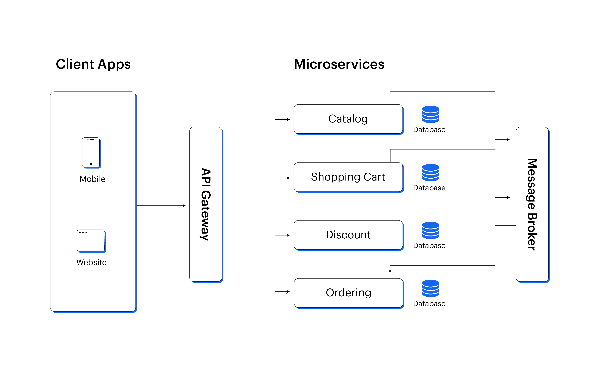
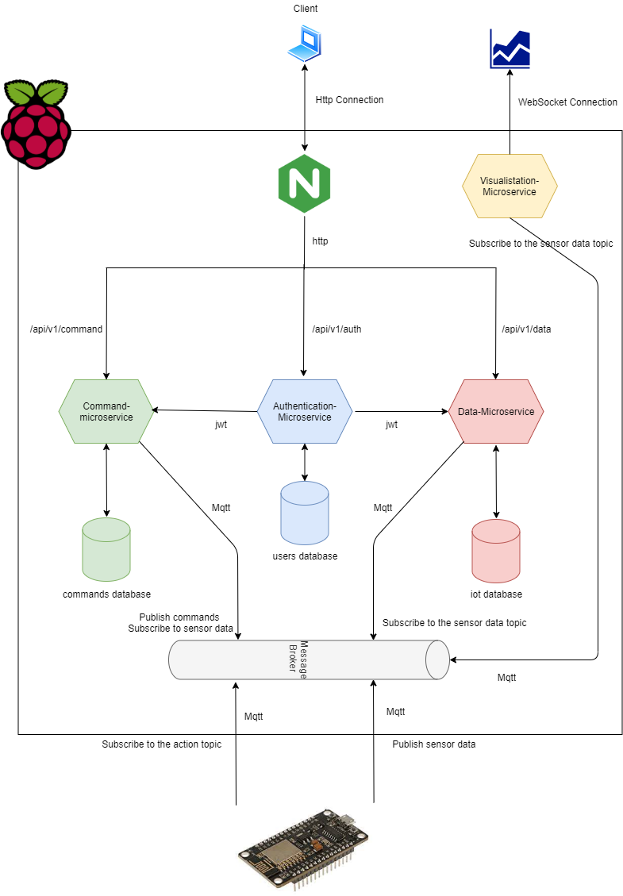

---
## Slides uge 14 - Docker, containerization, micro service arkitektur

---
## Docker intro

* Docker er virtualisering på applikationsniveau
* Tænk en VM med de minimale krav for at køre en applikation, som f.eks. en database, en MQTT broker, en webside osv.
* CLI-baseret for at holde det småt - Debian 12 fylder 117MB i Docker

---
## Hvorfor bruger vi Docker?

* Udvikle og hoste applikationer. F.eks. kan vi meget hurtigt hente et SQLite3 image der har OS + SQLite3 med `docker pull keinos/sqlite3`, og så er vi kørende
* Det smarte er at det er hurtigere at teste applikationer end med en hel VM.
* Det er let at "undo" fejl, for ændringer er ikke gemt medmindre du manuelt gør det
* Det er portable, så vi kan let flytte det fra PC til PC. F.eks. nice til cloud deployment
* Meget andet...

---

## Hvorfor Docker og ikke en VM?

* Letvægt, og du kan let køre mange containere (containere "wrapper" en Docker applikation) på én PC, og styre hvilke der må kommunikere med hvem (min Raspberry Pi 4 kører media server, backup, Google Photos alternativ, lokal Git server, mm. i Docker)
* Via en `dockerfile` kan du beskrive ændringer, såsom tilføjede programmer, filer, konfigurationer osv. til dit image og andre kan bare bygge dit færdige image fra dette. F.eks. til deployment på server, eller hvis en hel afdeling skal have samme PC setup

---

## Docker lyder fedt! Hvorfor ikke bare bruge det i stedet?

* Mere låst end en VM by default. Intet net (ikke engang lokalt) indtil du manuelt åbner. OS er barebones, så det har højest sandsynligt ikke de programmer du skal bruge fra start af.
* Visse egenskaber har ekstremt dårlig understøttelse i Docker. F.eks. audio I/O, grafik I/O. Desuden kan persistence (gemme data på host) være bøvlet. 
* Docker egner sig bedst til enkelte applikationer, som så kommunikerer med hinanden over net. Hvis der er brug for en monolitserver giver det nok bare mere arbejde.

---

## Docker og microservicearkitektur

* For virkeligt at forstå hvad Docker egner sig til, er det vigtigt at forstå microservicearkitektur, da det er en softwarearkitektur som Docker har som underliggende filosofi, og det egner sig mest til projekter som passer ind i microservicearkitektur

---
## Microservicearkitektur illustreret - mere generisk

## Microservicearkitektur illustreret - mere specifik

---

## Illustrationer forklaret

* Se hver node som noget der egner sig til at være én enkelt container
* Hvis én går ned eller fejler, så kører resten stadig
* Det er muligt at push en ændring til en container og hotswappe ind i systemet
* Det er muligt enten at have forskellige maskiner køre forskellige containerer, én eller flere hver, samt duplikere en container til en backupserver

---

## Så i gang - navigér i Dockermiljøet

* Læs og forklar til hinanden hvad forskel på image og container er. Se docs: https://docs.docker.com/get-started/docker-concepts/the-basics/what-is-a-container/ og https://docs.docker.com/get-started/docker-concepts/the-basics/what-is-an-image/
* Hent et rå Debian 12 image via `docker pull debian`. Derefter kør `docker run debian`, så er i i CLI. Brug `ls` til at check hvad der er. Brug `apt list` til at se hvad der er installeret. Prøv selv at installére noget (f.eks. en af de services vi nu skal bruge til FMS).

---

## Persistence i Docker

* Ændringer i filer er borte når i går ud af CLI'en. Det kan i teste - ændre i en config, installer noget med apt, gå ud (`ctrl + d`) og ind igen (`docker run debian`) og det er stadig barebones. Not a bug, but a feature.
* Se Docker CLI som noget hvor i kan teste ændringer uden at kunne lave ødelæggende/permanente ændringer.

---
## Hvordan persistence i Docker

* Configs, installerede filer osv. skal beskrives i en `Dockerfile`. Bare en fil der bogstaveligt hedder `Dockerfile` uden extenstion. Starter med det image det skal baseres på (f.eks. fra Docker Hub https://hub.docker.com/)
* Derefter kan i beskrive CLI kommandoer der skal køres, lidt á la et shell script, men syntax er ikke 1-1, og der er også specifikke Docker ting i kan (f.eks. interaktion med host). Alt beskrevet i Dockerfil bliver brugt til at bygge et image, og når i kører en container ud fra det image har det så altid alt det som standard der er beskrevet i `Dockerfile`
---

## Ressourcer til Dockerfile

* Officiel dokumentation, kort og kontant med eksempler: https://docs.docker.com/get-started/docker-concepts/building-images/writing-a-dockerfile/
* Officiel dokumentation med alle Dockerfile kommandoer: https://docs.docker.com/reference/dockerfile/
* Prøv dette basale eksempel på en todolist med Dockerfile og run kommandoer: https://docs.docker.com/get-started/workshop/02_our_app/
* Efter dette er det nedenstående opgaver specifikt til semesterprojektet

---

## Opgaver - overskrift

Hver gruppe skal lave begge opgaverr, men individuelt må i selv bestemme om i laver den ene eller den anden, eller begge.

1. Skriv dockerfile der kan bruges til at starte en SQLite3 database med gode "defaults"
2. Skriv dockerfile der kan bruges til at starte en MQTT broker med gode "defaults"

Husk i begge tilfælde at der skal konfigures netværk så lokale enheder kan forbinde.

---

## Bedømmelsesrubrik for Docker

| Concept              | Beginner (1-2)     | Proficient (3-4)       | Advanced (5)             |
| -------------------- | ------------------ | ---------------------- | ------------------------ |
| Container Networking | Basic port mapping | Custom bridge networks | Multi-host communication |
| Data Persistence     | Bind mounts        | Named volumes          | Volume drivers           |
| Error Handling       | Basic logging      | Health checks          | Auto-recovery            |
| System Integration   | Single service     | 2-3 containers         | Full CI/CD pipeline      |
Opgave 1+2 har noget fra beginner og proficient, opgave 3 er blandet proficient og advanced.

---
## Opgave 0 - Setup

* Installér Docker Engine - https://docs.docker.com/engine/install/
* Sæt rootless mode op; mere sikkert da du slipper for at Docker bruger root-rettigheder - https://docs.docker.com/engine/security/rootless/
* Ikke et krav fra underviser, men godt for sikkerhed(sinterreserede) - SSH til at forbinde - https://docs.docker.com/engine/security/protect-access/

---
## Opgave 1 DB - kravspecifikation

* Basér databasen på jeres butik eller hvis i har, så data fra FMS projekt
* Bruger en letvægtsdistribution såsom Alpine eller Debian
* Når brugeren har kørt `docker build` så skal følgende gælde:
	* Tables er sat op med korrekte kolonner
	* Kan verificere at SQLite3 service er oppe at køre
	* Det er muligt at INSERT og SELECT på tabeller fra et script der kører uden for Docker
	* Data er persistent på PC *selv* hvis Docker image går ned (bind mounts/volumes)
	* Sørg for at porten ikke overlapper med porte på host PC

---

## Opgave 2 MQTT - kravspecifikation

* Skal bygges på det officielle mosquitto image: https://hub.docker.com/_/eclipse-mosquitto
* Der skal være brugerautenticering (med eller uden TLS)
* Logs skal være persistent via bind mount eller volumes (så vi kan SSH'e ind i og troubleshoot hvis uheldet er ude)
* Subscriber skal tilføjes til brokeren i dette image via dockerfile. 
* Sørg for at porten ikke overlapper med porte på jeres host PC

---

## Opgave 3 - Ekstraopgave til de dedikerede (ikke til eksamen, men erhvervsrelevant)

* Sørg for at begge containere fra henholdsvis opgave 1 og 2 har forbindelse med hinanden
* Sørg for at logs fra MQTT broker bliver indsat i en særskilt tabel i SQLite3 image
* Sørg for at logs har tidsstempel i en særskilt kolonne

