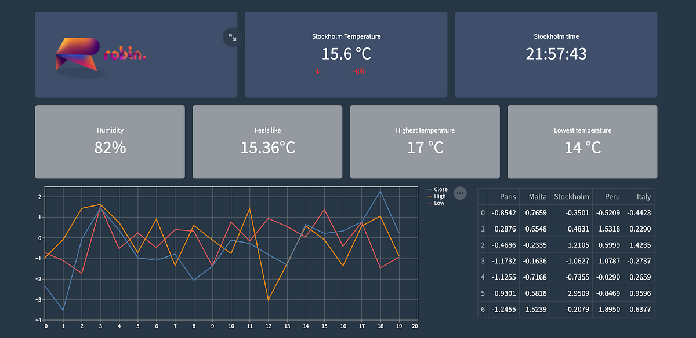

---

## Uge 17 - C++ vs Python samt Streamlit

---

## Hvad er et programmeringssprog?

* Notation for at skrive computerprogrammer
* Efter kompilering kan du i princippet få det samme resultat, om du bruger C, C++, C#, Java etc.
* Syntaks, semantik osv. kan variere vældigt mellem sprog

---

## Hvorfor er der så mange programmeringssprog?

* Forskellige syntaks, semantik osv. kan gøre visse ting lettere eller sværere
* F.eks. er det vanskeligt at skrive en webapplikation i C, men relativt let i Python
* Derimod er det meget vanskeligt at skrive embedded kode, eller drivere i Python, men relativt let i C.
* Se sproget som et værktøj - kan du hamre en skrue i dit skab? Ja, men...

---

## C++ og Python specifikt

* C++ er superbt når vi skal snakke med operativsystemet; f.eks. programmer i Linux såsom Mosquitto og SQLite, eller når vi skal arbejde med indlejrede systemer
* Dog er det som efterkommer af C stadig besværligt med webapplikationer
* Her kommer Python ind - det er bedre egnet til API-kald, hosting af websider, samt dataanalyse 

---

## Primære tekniske forskelle mellem sprogene 1 - Typer

* C++ er typestærkt - variable deklareres som f.eks. int og det må ikke ændre sig medmindre programmøren eksplicit vælger det. Med andre ord, typen er valgt ved `compile-time`, ikke `runtime`.
* Python er typesvagt; typer på variable kan ændre sig også i `runtime`.
* Kode er længere i C++, men programmøren har fuld kontrol, og når koden er kompileret vil der ikke ske fejl ifht. typer.
* Kode er kortere i Python, men dårligere performance, og der kan ske fejl med typer midt i runtime.

---

## Primære tekniske forskelle 2 - Kompilering

* C++ er et kompileret sprog; altså kompilere vi hele koden før vi kører programmet
* Python kører vi programmet linje for linje (`just-in-time kompilering`), og derfor kan problemer opstå i runtime. Det har dog den fordel at det er lettere at dele kode med andre og få det til at køre.
* C++ har meget højere performance (både hastighed og pladsmæssigt) grundet kompilering, da compileren på forhånd ved hvad der er brug for, og den kan lave optimeringer baseret på det.
* Python er typisk meget langsommere end C++ (faktor 10-100, kommer an på workload)

---

## Tommelfingerregler

* Brug C++ hvis programmet skal være:
    * Tidskritisk og præcist,
    * Letvægt (f.eks. embedded eller andet low-level)
* Brug Python hvis programmet skal:
    * Kontakte webservere ofte
    * Host på web
    * I arbejder med API'er 
    * Machine learning og AI af ikke-åbenlyse årsager...
---

## Streamlit



---

## Python til Streamlit - hvorfor?

* Streamlit er teknisk set en webserver med en grafisk brugerflade (2 ting C++ ikke gør let)
* Der er indbygget forbindelsesscripts til f.eks. databaser, JSON-filer, CSV-filer osv.

---

## Eksempler

* De næste eksempler bliver også vist på tavlen og gennemgået i flere detaljer.

---

## Basalt element på dashboard

```Python
import streamlit as st 
st.title("Sensor Dashboard")

sensor1, sensor2 = st.columns(2)

sensor1.metric(
    label="Temp",
    value = 30)

sensor2.metric(
    label="Humidity",
    value = 60)
```

## Graf på dashboard 

```Python
st.header("Graf over sidste 7 temperaturmålinger") # HTML header
chart_data = [22, 25, 23, 27, 30, 33, 35] # Array med integers
st.line_chart(chart_data)
```

---

## Forbindelse til database eksempel

```Python
import streamlit as st # Ækvivalent til #include i C++

conn = st.connection('test.db', type='sql') # Variable kræver ikke typedeklaration
with conn.session as s:
    s.execute('CREATE TABLE IF NOT EXISTS sensors ( TEXT, pet TEXT);')
    s.commit()

pet_owners = conn.query('select * from table_name')
st.dataframe(pet_owners)
```
