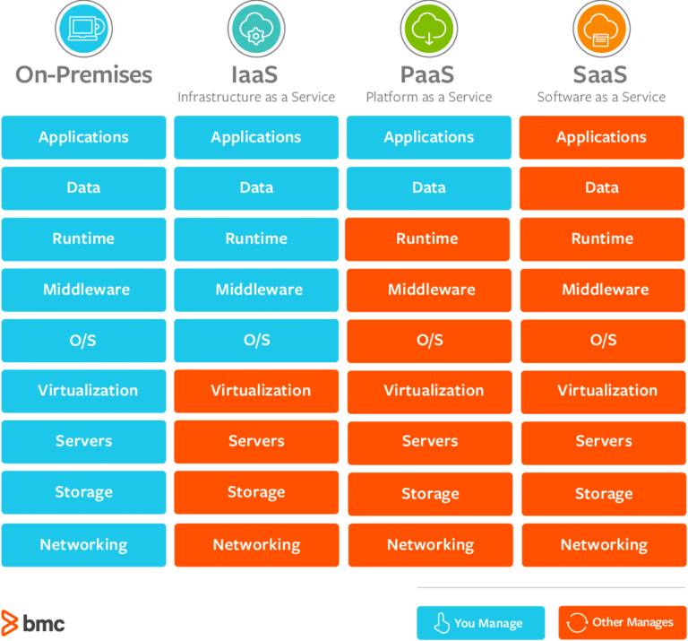
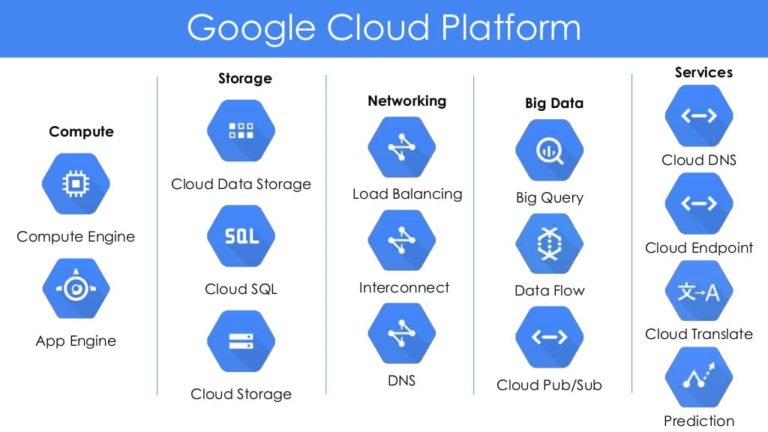

# Uge 20 - cloud deployment
---
## Agenda
- Typer af cloud services
- Cloud deployment - overblik
- Cloud hosts i dag og deres forskelle
- Deployment af services - hvad skal vi være opmærksomme på
- Docker i deploymentregi
- Mix af cloud hosts til forskellige services/applikationer
---
## Cloud servicemodeller

---
## Cloud services - SaaS
- Tænk sådan noget som Zoom, Netflix, Slack osv.
- I kan streame noget data, men al persistence, encoding, opdateringer osv. sker på host-platformen
---
## Cloud serices - PaaS
- Kombineret infrastruktur, men i har egentligt adgang til alt for gå direkte igang med at udvikle og køre applikationer derpå.
- F.eks. Huggingface - smid en Dockerfile derpå og den er prækonfigureret til at gøre det den skal med filen
- I har dog ikke adgang til f.eks. SSH, OS og virtualisering på serveren, og slet ikke hardware.
---
## Cloud services - IaaS
- F.eks. AWS og Azure, hvor I har direkte adgang til OS, runtime og middleware
- Typisk når vi gerne vil kunne justere på detaljerne i deployment
- Eller når vi gerne vil have direkte storage access og OS access
---
## Når vi vælger model...
- Tænk på hvilke applikationer og hvor meget konfigurering i skal have adgang til
- Derfra vælg om det er SaaS, PaaS, IaaS osv. der passer bedst
- Til sidst så er det muligt at filtrere ned til specifikke hosts såsom AWS, HiveMQ, Zoom etc.
- Derefter det bare et spørgsmål om pris og præference, og nogle gange bestemmer virksomheden bare.
---
## Eksempler på cloud services og applikationer

---
## Opgave 0 - hvilken aaS?
- Antag at host/provider sørger for så meget som nødvendigt for at i kan arbejde med servicen/applikationen
- Med den antagelse, hvor vil i placere hver platform i ovenstående diagram over Google Cloud Platform services?
- Diskutér i grupper og opnå en enighed - bedste gæt på 5 minutter.
- Hint: Godt overblik på linket i skulle læse til forberedelse.
---
## Deployment af services og applikationer
- Når en provider er valgt, så står deployment tilbage. Her står vi ideelt med:
- En hel PC i tilfælde af IaaS, men uden i selv kan skifte storage, fysisk netværk osv.
- En applikation i kan hive data ud af, eller putte ind i - f.eks. ved HiveMQ eller en cloud database.
- Eller SaaS, men det er lidt sjældent IT Teknolog brancher at det er jeres valg, f.eks. mht. Zoom vs Teams osv.
---
## Deployment steps
- Eksempler på tavle med en typisk AWS docker setup via GitHub.
- Kort oversigt:
    - GitHub repository med nødvendige konfigurationsfiler, Dockerfile osv. klargøres 
    - Når i er SSH'et ind i VPS, så opret/find public SSH nøgle og registrer med jeres GitHub konto 
    - Clone til VPS. 
    - Installér alt der er nødvendigt for jeres Docker installation
    - Byg jeres services via Docker.
---
## Opgave 1 - Deployment arkitektur
- I grupper - 15 minutter til at nå en beslutning
- Vi har stadig MQTT, Streamlit og database i systemet
- Hvilken type aaS vurderer i egner sig til de forskellige komponenter? Det kan være flere typer på et komponent.
- Beslut nu hvilken cloud provider i bruger til de forskellige. Vigtigt at holde jer indenfor HiveMQ, Hetzner, AWS, Huggingface eller ækvivalente. Det vigtige er at i kan vælge.
---
## Opgave 2 - Hvilken type aaS 2?
- De cloud providers i har besluttet jer for at bruge, hvilken type aaS er de?
- Giver den type mening for det færdige setup?
---
## Opgave 3 - Deployment
- Med en nøje udvalgt provider og platform, så er det på tide at deploy vores systemer på cloud.
- Start med MQTT
- Derefter database - her kan det tage tid at forbinde MQTT og database afhængigt af hvilke platforme i har valgt.
- Til sidst find ud af hvordan i vil køre Streamlit - det er normalt okay at køre lokalt. Kan i forklare hvorfor?

