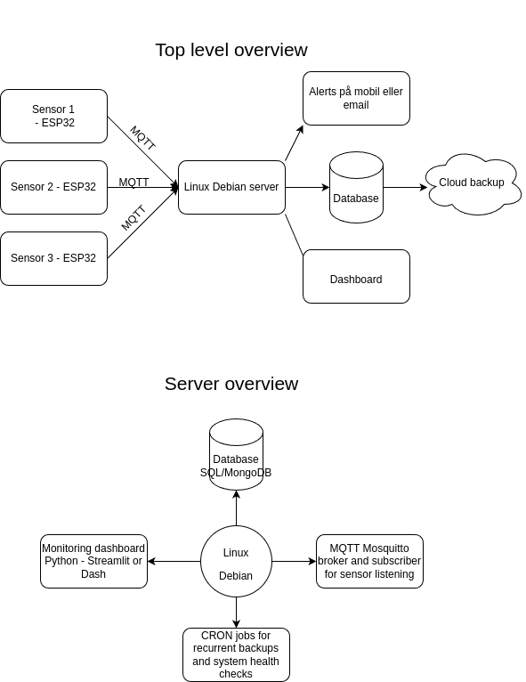

---
## Uge 4 - Introduktion og Linux terminal basics
---
### Agenda

* Introduktion til semesteropgave
* Introduktion til Linux som en serverplatform
* Opsætning af Linux Debian 12
* Basale terminalkommandoer
* Øvelser - overvåg en logfil

---
### Introduktion til semesteropgave i programmering

---
### Det der ikke står i diagrammet

* Docker så i lærer containerization (en speciel type virtualisering)
* Test, test, test!
* Logging

---
### Målene
* At i lærer basale metoder i serveradministration
* Får et dybere kendskab til operativsystemer
* Basal sikkerhed i praksis
* At i har en platform der kan binde viden om databaser, server, kommunikationsprotokoller og sikkerhed sammen

---
### Sammenhæng med projektfaget

* Der er ikke direkte kobling denne gang. I har jeres testsetup til programmering, hvor i lærer og anvender en masse teknologier der også har relevans til projektet. Men kravene er ikke nødvendigvis ens! Og timingen bliver i høj grad asynkront.

---
### Relevans i jobmarkedet

* Serveradministration har altid været aktuelt 
* Docker, og derfor Linux samt databaser kommer man ikke udenom i ethvert udviklerjob derude
* Testing via unit testing biblioteker er kotyme i mellem og større organisationer (og god skik generelt)
* Logging er anvendt i alle typer enheder overhovedet til at opdage fejl efter programmet er startet

---
### Hvorfor Linux?

* Det er mere åbenlyst hvordan operativsystemet hænger sammen så i lærer automatisk undervejs operativsystemets komponenter at kende
* I indlejrede systemer (såsom telefoner, informationstavler, professionelt PA osv.) samt serveradministration finder det bred anvendelse. Læs: https://www.omgubuntu.co.uk/2016/08/25-awesome-unexpected-things-powered-linux
* Free and open source, og i aktiv udvikling med forskellige specialer

---
### Øvelse 1: Installér og sæt op

* Anbefalet VMWare! I kender det, og det er let (vi skal ikke forbinde det med alt muligt)
* Brug guide (eller bare hent Debian 12 iso og gør hvad i plejer) til at installere Debian 12 på jeres system - Opgave 1 på ItsLearning
* Løs opgave 2 på ItsLearning når i har installeret Debian og er kommet ind.
* Vejledning undervejs så alle er startet op.
---
### Oplæg del 2

* Viser live på tavlen:
	* måder at navigere via `cd` og bruge `tree` kommandoen for at lære strukturen af filsystemet at kende
	* brugen af `cat`, `head` og `tail` til at læse filer mens vi navigerer gennem forskellige konfigurationer.
	* Brug af `grep`

---

### Øvelse 2: 

* Løs opgave 3. 

---
### Efter frokost: Oplæg del 3 og opgave 4

* Gennemgang af `watch` kommando, `|` (pipe), og logfiler.
	* Hvordan overvåger vi handlinger på en server? 
	* Hvordan ser en logfil ud og hvad kan jeg bruge den til?
* Al denne viden anvender vi så til at løse opgave 4.
