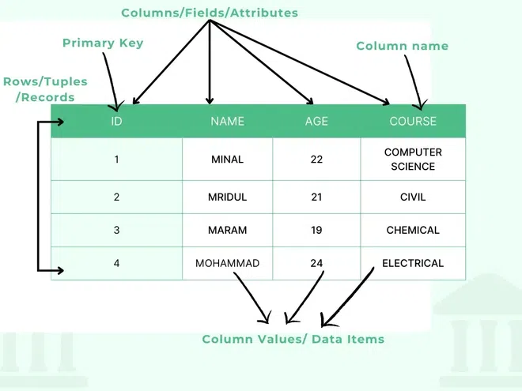

---
## Uge 6 - SQL databaser via shell scripting og C++

---
## Agenda

* Hvorfor databaser og SQLite?
* Hvem benytter det til hvad?
* CRUD operationer
* CRUD i shell
* CRUD i C/C++
---
## Hvorfor databaser?

* Hurtigere at søge i end løse filer
* Skaber ét universelt søgesprog
* For at skabe struktur over vores data
* Datasikkerhed - integritet (vi snakker ACID senere i dag)

---
## Hvorfor SQLite (fremfor andre databaser)?

* Simpel og fleksibel da selve dataen er i én fil.
* Udviklerne sigter efter at de eksisterende funktioner ikke ændrer sig før mindst 2050
* Virker på embedded systems - selv på en ESP32
* Er nok til de fleste formål der ikke kræver simultane klientforbindelser

---
## Hvem bruger SQLite?

* De mest optimale anvendelser er:
	* Embedded IoT - midlertidig cache til sensordata på en ESP32, eller bare edge database på en lidt større enhed
	* Smartphones - i Android kan udviklere bruge indbygget database til data delt mellem apps
	* Browsers - konfigurationer og cookies
	* Cache til større databaser

Læs mere på: https://www.sqlite.org/whentouse.html

---

## SQL table terminologi



---

## SQL tabeller - videre

* Som i kan se kan de læses som et spreadsheet a lá Excel.
* Primary key er til unikt at identificere en række - bruges ofte som indeks
* Når vi søger bruger vi oftest kolonner og conditions.

---
## SQL syntax

* Eksempler bliver gennemgået på tavlen
* Vi starter med at bruge en eksempel database på at lære syntax. Download fra: https://www.sqlitetutorial.net/sqlite-sample-database/ - udpak zip så du har filen chinook.db
* Vi starter med at bruge GUI værktøjet DB Browser for SQLite (installeret via kommando vist på ItsLearning)

---

## SELECT statement basics

* VI kan vælge al data fra en bestemt tabel via * operatoren:
```sql
SELECT * FROM ALBUMS;
```
* Ellers skal vi bruge et kolonnenavn
```sql
SELECT TITLE FROM ALBUMS;
```

---

## SELECT conditions

* Her bruger vi `WHERE` og ikke `if`. F.eks.:
```sql
SELECT TITLE FROM ALBUMS WHERE ArtistId=16;
```
* I kan også bruge sammenligningsoperatorer til det
```sql
SELECT TITLE FROM ALBUMS WHERE ArtistId < 10;
```


---

## SELECT operator tabel

| Operator | Beskrivelse                                                      |
| -------- | ---------------------------------------------------------------- |
| =        | Lig med                                                          |
| >, <     | Større end, mindre end. Et lighedstegn kan tilføjes for inklusiv |
| <>, !=   | Ikke lig med                                                     |
| BETWEEN  | Imellem. F.eks. BEWEEN 50 AND 60                                 |
| LIKE     | Søg efter pattern, ligesom man kan med `grep`                    |

---
## Sortér resultater

* Gøres med ORDER BY keyword. F.eks.:
```sql
SELECT TITLE FROM ALBUMS
ORDER BY TITLE;
```
* DESC kan tilføjes til sidst hvis i ønsker at få det sorteret høj til lav.

---

## CREATE table

* Vigtigt at have strukturen i orden når det er SQL tabeller.
* Kolonnenavne, om det er primary key, samt hvilken type der må være i kolonnen skal være besluttet

---

## CREATE table syntax

```sql
CREATE TABLE Persons (  
    PersonID int,  
    LastName text(255),  
    FirstName text(255),  
    Address text(255),  
    City text(255)  
);
```

---

## Type table

| Type    | C++ ækvivalent |
| ------- | -------------- |
| NULL    | null           |
| INTEGER | int            |
| REAL    | float          |
| TEXT    | string         |
| BLOB    | byte           |

---

## INSERT 

* Bruges når vi indsætter data. Skal følge samme struktur som ved create table. Altså rækkefølgen af værdierne skal passe med kolonner i tabel.
```sql
INSERT INTO Persons VALUES (8, "Jensen", "Søren", "Vejgade", "Odense C");
```
* Sammenlign med strukturen fra CREATE på forrige slide.

---

## Ændre/tilføje kolonner

* Gøres via ALTER table kommandoen + et keyword
* Tilføj kolonne med ADD
```sql
ALTER TABLE Customers  
ADD Email varchar(255);
```

---

Ændre navn på kolonne

```sql
ALTER TABLE _table_name_  
RENAME COLUMN _old_name_ to _new_name_;
```

---

## Specielt for SQLite

* Med ALTER er der specielle begrænsninger i SQLite sammenlignet med andre sprog.
* https://www.sqlite.org/lang_altertable.html

---
## Datoer og tidstempler

* Detaljer her: https://www.sqlite.org/lang_datefunc.html
* Læg mærke til at der ikke er en datatype til datoer og tider
* Anbefalingen er at bruge unix epochs, som kan gemmes som integer

---

## Unix epochs

* I Linux kan terminalkommandoen `date +%s` give dig Unix epoch - sekunder siden 1. Januar 1970, UTC. 
* Output indsætter du så bare i shell script f.eks. via et variabel

---
## Unix epochs i C++

```cpp
#include <ctime>
#include <iostream>
 
int main()
{
    std::time_t result = std::time(nullptr);
    std::cout << std::asctime(std::localtime(&result))
              << result << " seconds since the Epoch\n";
}
```

---
## Konverter tilbage til human-readable dato og tid fra Unix

```cpp
#include <ctime>
std::asctime(std::localtime(&unix))
```
hvor unix er variablet for dit unix timestamp.
```bash
date -d @1738824265
```
---